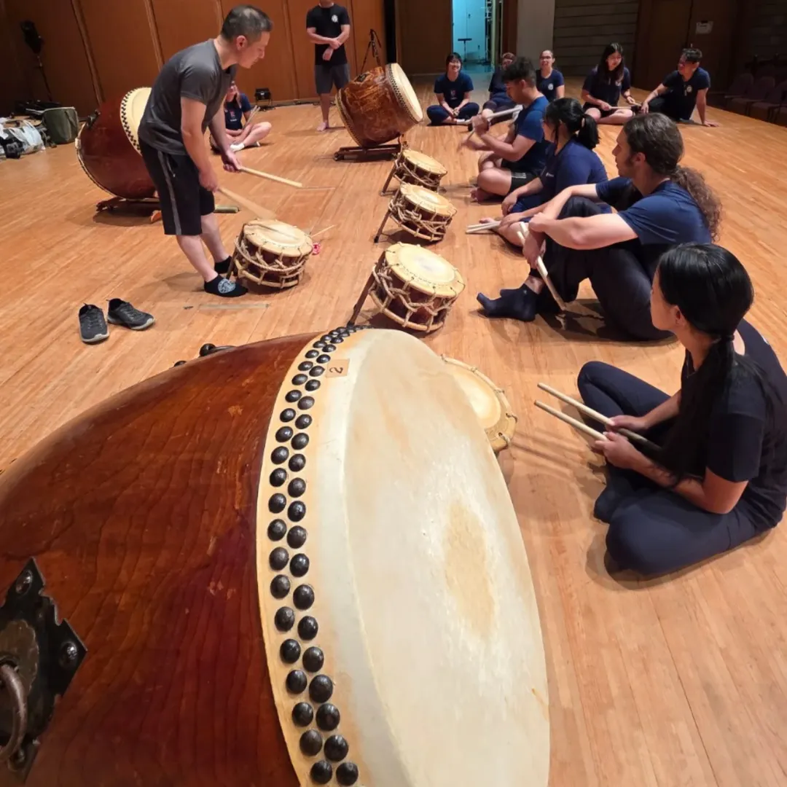

# IkkonAdmin

<p align="center">
  
</p>

<h3 align="center">Sistema administrativo e site institucional para o IKKON SPTD | Escola de Taiko</h3>

<p align="center">
  <strong>ASP.NET Core MVC · Entity Framework Core · SQL Server · Razor Views · Bootstrap 5</strong>
</p>

<p align="center">
  <a href="#sobre-a-escola">Escola</a> ·
  <a href="#sobre-o-projeto">Projeto</a> ·
  <a href="#funcionalidades">Funcionalidades</a> ·
  <a href="#arquitetura-e-tecnologias">Tecnologias</a> ·
  <a href="#como-rodar-localmente">Como rodar</a>
</p>

---

## Sobre a escola

O **IKKON SPTD | Ikkon São Paulo Taiko Dojo** é uma escola de taiko em São Paulo dedicada ao ensino de percussão japonesa, fue e teoria musical. A escola une cultura japonesa, disciplina, musicalidade, energia de grupo e presença de palco, acolhendo alunos iniciantes e pessoas com diferentes níveis de experiência.

Além das aulas, o IKKON também atua como grupo artístico em apresentações, eventos culturais, festivais, ações especiais e shows.

<p align="center">
  
</p>

**Mensagem central da escola:** ensino de percussão japonesa para todos.

**Endereço:** Rua Domingos de Morais, 2975, São Paulo, Brazil

**Canais oficiais:**

- Instagram: [@ikkontaiko](https://www.instagram.com/ikkontaiko/)
- TikTok: [@ikkontaiko](https://www.tiktok.com/@ikkontaiko)
- Facebook: [Ikkon Taiko](https://web.facebook.com/ikkontaiko/?_rdc=1&_rdr#)
- E-mail: [contato@ikkontaiko.com](mailto:contato@ikkontaiko.com)
- WhatsApp: [+55 11 93779-9916](https://wa.me/5511937799916)

## Sobre o projeto

O **IkkonAdmin** é uma solução web criada para apoiar a operação administrativa da escola, substituindo controles manuais feitos em planilhas, Notion, WhatsApp e registros financeiros descentralizados.

Este projeto está sendo desenvolvido como um **trabalho voluntário**, com o objetivo de ajudar a escola a organizar processos internos, reduzir retrabalho operacional e criar uma base tecnológica evolutiva para os próximos anos.

A proposta não é criar um sistema complexo demais, mas sim uma ferramenta administrativa real, clara e útil para o dia a dia da equipe.

## Problema que a solução resolve

Antes do sistema, os principais processos dependiam de controles manuais:

- cadastro e acompanhamento de alunos;
- mensalidades, atrasos, descontos e acordos financeiros;
- admissões e integração de novos alunos;
- desligamentos e encerramento financeiro;
- graduação e histórico de níveis;
- inventário de instrumentos e equipamentos;
- agenda de aulas, eventos e compromissos;
- permissões de acesso para equipe interna.

O IkkonAdmin centraliza essas informações em um painel interno, com autenticação, controle de permissões e rotas separadas para área administrativa e área do aluno.

## Site institucional

O projeto também contém uma landing page institucional para apresentar a escola, separar a comunicação entre aulas e eventos, e facilitar contato com potenciais alunos ou contratantes.

Rotas institucionais principais:

- `/` - Home institucional
- `/escola` - Página focada nas aulas e cursos
- `/eventos` - Página focada no grupo artístico e apresentações
- `/contato` - Contato institucional

<p align="center">
  
  
</p>

## Vídeos da escola

### Aulas e prática

| Vídeo | Link |
|---|---|
| <a href="https://youtu.be/4iX-E6uIAXI"></a> | [Assistir no YouTube](https://youtu.be/4iX-E6uIAXI) |
| <a href="https://www.youtube.com/watch?v=b7DFAQNTpAg"></a> | [Assistir no YouTube](https://www.youtube.com/watch?v=b7DFAQNTpAg) |
| <a href="https://www.youtube.com/watch?v=FlwgqLo6yBI"></a> | [Assistir no YouTube](https://www.youtube.com/watch?v=FlwgqLo6yBI) |

### Apresentações e eventos

| Vídeo | Link |
|---|---|
| <a href="https://youtu.be/2n3U_-pqmZY"></a> | [Assistir no YouTube](https://youtu.be/2n3U_-pqmZY) |
| <a href="https://youtu.be/ts0OQIXZ5m4"></a> | [Assistir no YouTube](https://youtu.be/ts0OQIXZ5m4) |
| <a href="https://youtu.be/2IDfcF9q_Wc"></a> | [Assistir no YouTube](https://youtu.be/2IDfcF9q_Wc) |

## Funcionalidades

### Área administrativa

- Dashboard operacional com indicadores reais.
- Cadastro, edição, filtros e detalhes de alunos.
- Controle de turmas e vínculo de alunos com múltiplas turmas.
- Financeiro com mensalidades, pagamentos, atrasos, acordos e descontos.
- Admissões com acompanhamento de aula experimental, matrícula e checklist.
- Desligamentos com pendências, motivo, confirmação e encerramento.
- Graduações com exames, resultados e histórico de nível.
- Configurações de conta, preferências, senha e histórico de acessos.
- Painel administrativo para usuários, cargos, permissões e auditoria.
- Inventário de taikos, bachis e equipamentos.
- Integração com Google Agenda para eventos e compromissos.

### Área do aluno

A área do aluno foi separada da área administrativa para preparar uma experiência própria para alunos.

- Login separado em `/aluno/login`.
- Portal em `/area-do-aluno`.
- Perfil do aluno autenticado.
- Turmas vinculadas.
- Resumo financeiro individual.
- Proteção por vínculo `UsuarioSistema.AlunoId`.

### Controle de acesso

O sistema usa autenticação por cookie/sessão e autorização baseada em roles, claims e policies.

Perfis principais:

- `ADMIN`
- `FUNCIONARIO`
- `ALUNO`

Exemplos de permissões:

- `ALUNOS_VIEW`, `ALUNOS_CREATE`, `ALUNOS_EDIT`
- `FINANCEIRO_VIEW`, `FINANCEIRO_EDIT`
- `GOOGLE_AGENDA_VIEW`, `GOOGLE_AGENDA_MANAGE`
- `INVENTARIO_VIEW`, `INVENTARIO_MANAGE`
- `GERENCIAR_USUARIOS`, `EDITAR_PERMISSOES`

## Arquitetura e tecnologias

O projeto segue uma arquitetura MVC em camadas simples, adequada para um sistema administrativo interno em evolução.

```text
IkkonAdmin
├── IkkonAdmin.Web
│   ├── Controllers
│   ├── Data
│   │   ├── Configurations
│   │   └── Migrations
│   ├── Enums
│   ├── Models
│   │   ├── Entities
│   │   └── ViewModels
│   ├── Security
│   ├── Services
│   ├── Views
│   └── wwwroot
├── GOOGLE_AGENDA_SETUP.md
├── USUARIOS_ACESSO.md
└── README.md
```

### Stack principal

- **.NET 10 / ASP.NET Core MVC** para estrutura web.
- **Razor Views** para renderização server-side.
- **Entity Framework Core 10** para acesso a dados e migrations.
- **SQL Server** como banco relacional.
- **Bootstrap 5** como base de layout responsivo.
- **CSS customizado** para identidade visual administrativa e institucional.
- **Data Protection** para proteção de tokens sensíveis da integração Google.
- **HttpClient** para comunicação com Google Calendar API.

### Decisões técnicas

- **MVC server-side**: reduz complexidade inicial e entrega produtividade para um sistema administrativo interno.
- **Services em vez de repositories genéricos**: mantém regras de negócio claras sem abstrações desnecessárias no MVP.
- **ViewModels por tela**: evita expor entidades diretamente nas views e melhora controle de dados exibidos.
- **Policies e claims**: permite controle granular por módulo e ação.
- **Migrations versionadas**: mantém evolução do banco rastreável.
- **Rotas separadas para aluno e administração**: evita misturar CRUD interno com portal do aluno.

## Banco de dados

O sistema usa SQL Server com Entity Framework Core Migrations.

Entidades principais:

- `Aluno`
- `Turma`
- `AlunoTurma`
- `Mensalidade`
- `Pagamento`
- `Desconto`
- `AcordoFinanceiro`
- `Admissao`
- `Desligamento`
- `Graduacao`
- `ExameGraduacao`
- `UsuarioSistema`
- `RoleSistema`
- `PermissaoSistema`
- `AuditLog`
- `InventarioItem`
- `InventarioMovimentacao`
- `GoogleAgendaConexao`

## Como rodar localmente

### Pré-requisitos

- .NET SDK compatível com `net10.0`.
- SQL Server ou SQL Server Express LocalDB.
- Git.
- Opcional: `dotnet-ef` para comandos de migration.

### 1. Clonar o repositório

```bash
git clone <url-do-repositorio>
cd IkkonAdmin
```

### 2. Restaurar pacotes

```bash
dotnet restore IkkonAdmin.Web/IkkonAdmin.Web.csproj
```

### 3. Configurar connection string

Arquivo principal:

```text
IkkonAdmin.Web/appsettings.json
```

Exemplo local:

```json
"ConnectionStrings": {
  "DefaultConnection": "Server=(localdb)\\MSSQLLocalDB;Database=IkkonAdminDb;Trusted_Connection=True;MultipleActiveResultSets=true;TrustServerCertificate=True"
}
```

### 4. Aplicar migrations

```bash
dotnet ef database update --project IkkonAdmin.Web/IkkonAdmin.Web.csproj --startup-project IkkonAdmin.Web/IkkonAdmin.Web.csproj
```

### 5. Rodar a aplicação

```bash
dotnet run --project IkkonAdmin.Web/IkkonAdmin.Web.csproj
```

A aplicação será aberta conforme a porta definida pelo ASP.NET Core, normalmente algo como:

```text
http://localhost:5037
```

## Como rodar com Docker Compose

O repositório inclui `compose.yaml` para subir a aplicação e um SQL Server local em containers.

### 1. Subir tudo

```bash
docker compose up --build
```

A aplicação fica disponível em:

```text
http://localhost:8080
```

O SQL Server fica disponível para ferramentas locais em:

```text
localhost,14333
```

Credenciais padrão de desenvolvimento do SQL Server:

```text
User ID: sa
Password: IkkonLocal!2026
Database: IkkonAdminDb
```

O app aplica migrations e seed automaticamente no startup via `DatabaseBootstrap.EnsureDatabaseReady`.

### 2. Personalizar portas ou senha

Copie o template:

```bash
cp .env.compose.example .env
```

Depois ajuste, se necessário:

```text
IKKONADMIN_HTTP_PORT=8080
IKKONADMIN_SQL_PORT=14333
IKKONADMIN_DB_NAME=IkkonAdminDb
IKKONADMIN_SQL_PASSWORD=IkkonLocal!2026
```

### 3. Parar containers

```bash
docker compose down
```

Para remover também o banco e uploads persistidos nos volumes:

```bash
docker compose down -v
```

## Usuários de demonstração

As credenciais de desenvolvimento ficam documentadas em:

```text
USUARIOS_ACESSO.md
```

Resumo:

| Perfil | Login | Senha | Destino |
|---|---|---|---|
| Admin | `funcionario.admin` | `Ikkon@123` | `/admin/painel` |
| Funcionário | `funcionario.operacional` | `Func@123` | `/admin` |
| Aluno | `aluno.demo` | `Aluno@123` | `/area-do-aluno` |

> Essas credenciais são apenas para desenvolvimento e demonstração. Em produção, todas devem ser alteradas.

## Google Agenda

A integração com Google Agenda exige um OAuth Client Web criado no Google Cloud.

O guia completo está em:

```text
GOOGLE_AGENDA_SETUP.md
```

Configuração esperada:

```json
"GoogleAgenda": {
  "ApplicationName": "IkkonAdmin",
  "CalendarId": "primary",
  "CredentialsPath": "",
  "OAuthClientSecretsPath": ".secrets/google-oauth-client.json",
  "RedirectUri": "http://localhost:5037/admin/agenda/google/callback",
  "TimeZone": "America/Sao_Paulo"
}
```

A pasta `.secrets/` é ignorada pelo Git e deve armazenar credenciais locais.

## Segurança

Cuidados já considerados no projeto:

- autenticação separada para administração e aluno;
- autorização por roles, claims e policies;
- validação server-side das ações protegidas;
- proteção de rotas administrativas;
- não exposição de dados administrativos na área do aluno;
- tokens do Google protegidos com ASP.NET Core Data Protection;
- uploads ignorados no Git;
- secrets fora do repositório.

## Roadmap técnico

Possíveis evoluções futuras:

- segunda via de mensalidade para alunos;
- pagamento online;
- upload e gestão de contratos;
- calendário de aulas na área do aluno;
- notificações internas;
- relatórios financeiros avançados;
- vínculo entre eventos da agenda e itens reservados do inventário;
- melhoria da auditoria administrativa;
- deploy com ambiente de produção e pipeline CI/CD.

## Licença e observação

Este projeto foi criado como uma iniciativa voluntária para apoiar a organização administrativa do IKKON SPTD.

O código e os assets institucionais devem respeitar a autorização da escola antes de qualquer uso externo, redistribuição ou publicação comercial.
